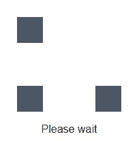
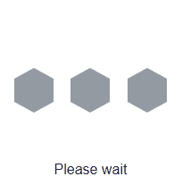
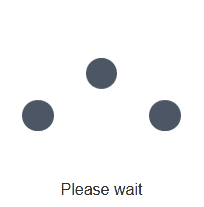
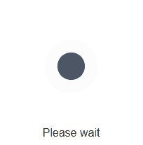
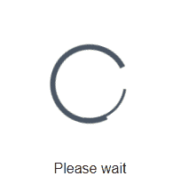
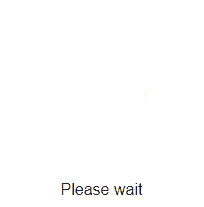
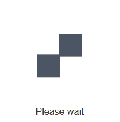

# vue-loaders

A collection of pure CSS loaders made available as Vue components.

## Features

Different CSS-loaders/-throbbers:

- `CirclingSquares.vue`:

- `FlippingHexagons.vue`:

- `JumpingDots.vue`:

- `PulsatingDot.vue`:

- `SpinningCircle.vue`:

- `TravellingBar.vue`:

- `WanderingSquares.vue`:

## Installation

`npm install @anedomansky/vue-loaders`

## Usage

TODO: add animation length prop
